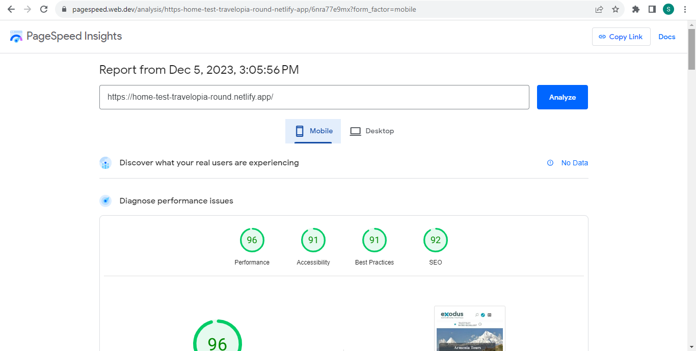
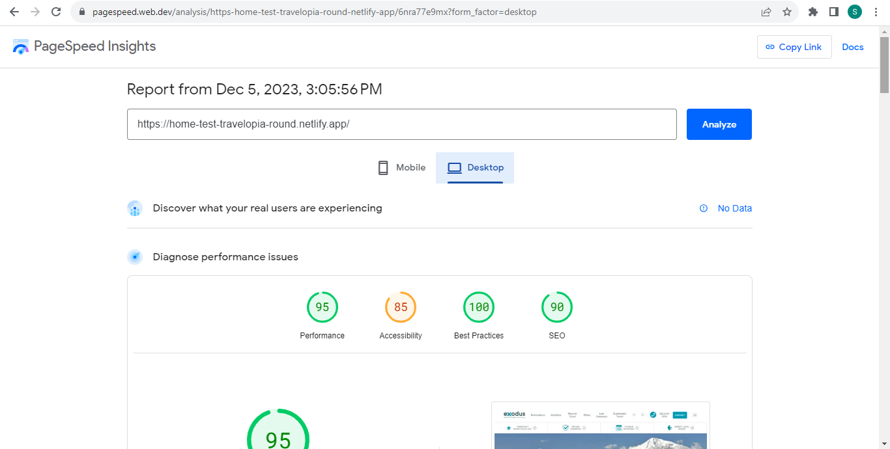
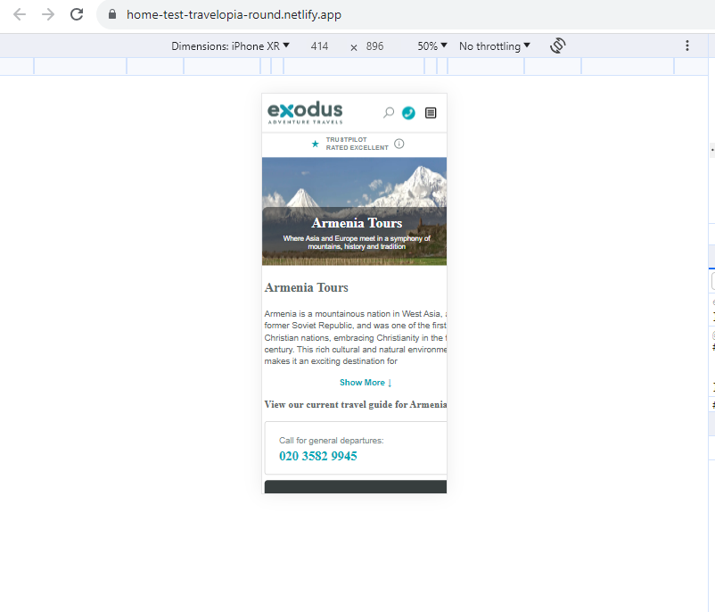
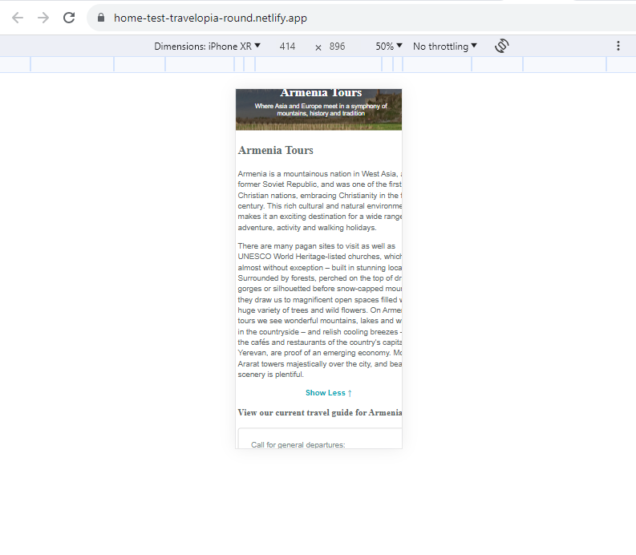

# Home-Test-Travelopia-Round-1

## Deployed Link
This is the deployed link on netlify-https://home-test-travelopia-round.netlify.app/

1. **Installation**
    - To install the project, follow these steps:
        - Clone the repository using the following command:
            ```bash
            git clone https://github.com/SankethGaniga95/Home-Test-Travelopia-Round-1.git
            ```
        - Install the required dependencies:
            ```bash
            npm install
            ```
## Testing
    - Jest testing library is used in the assignment for testing.
        - For testing use the following command:
           ```bash
           npx jest 
           ```

## Website Performance and Metrics
   - The website was tested in Pagespeed Insights
   - Here are the details as follows:
   -Mobile Screen Performance
   

   -Desktop Screen Performance
   


## Assignment 
   - Below are some of the screenshots of the given tasks
     Desktop Screen
    

     Mobile Screen
    
    

    

